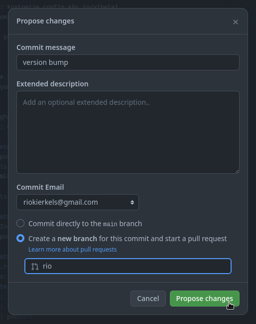
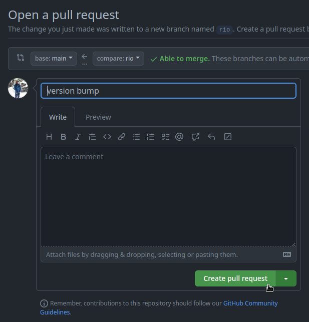
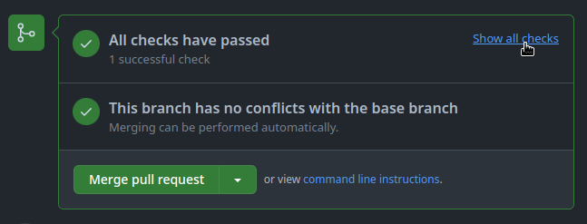
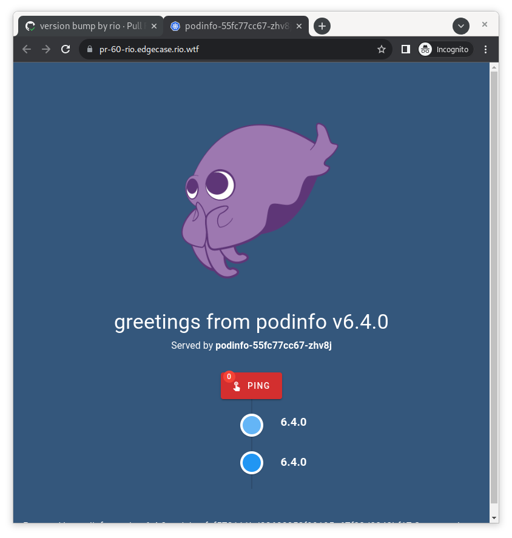
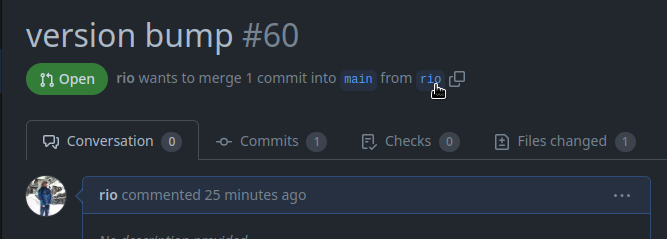
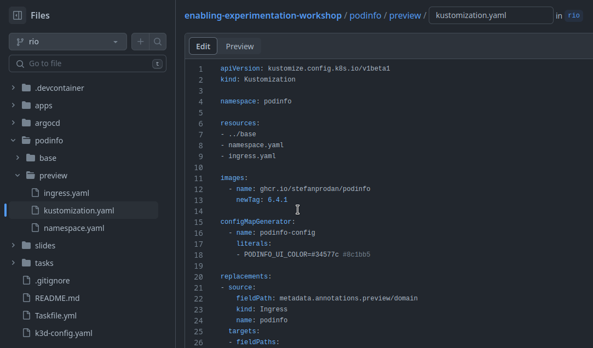
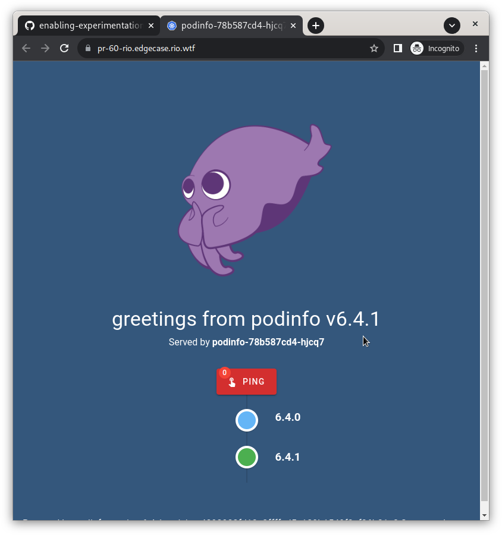

# Enabling Experimentation Workshop

This workshop will give you a hands on experience with enabling quick experimentation using ephemeral
environments in a pull request workflow. There are multiple ways to achieve this but in this workshop
we will use a declarative method that involves ArgoCD, Kubernetes, GitHub and vcluster.

## Requirements

You will only require a working GitHub account and a browser and internet access.

# Workshop Part 1 Application Deployment

## 1. Gaining access to the workshop repository

1.1 In your browser navigate to https://github.com/rio/enabling-experimentation-workshopstar

1.2 Click the star button.


## 2. Create a pull request

2.1 In the browser open the file `podinfo/preview/kustomization.yaml`.


2.2 Click the `Edit this file` button.


2.3 Change the `newTag` to `6.4.0`.


2.4 Commit the changes by clicking the `Commit changes` button.


2.5 Commit it to a new branch by clicking the `Create a new branch for this commit and start a pull request` button. Name your branch the same as your username. This will make it easier to find later.

2.6 Click `Propose changes`.



2.7 In the `Open a pull request` page click `Create pull request`.



## 3. Watch the cuttlefish

3.1 Wait for the orange `Some checks haven't completed yet` message to appear.


3.2 Once the green `All checks have passed` block appears, click the `Show all checks` button next to it.



3.3 Click the `Details` link next to the `app/...` check.


3.4 Watch the cuttlefish clap. Note the version of the podinfo image.



## 4. Update the application

4.1 Navigate back to your branch by clicking on your branch name near the pull request title.



4.2 Open the `podinfo/preview/kustomization.yaml` file and update the tag again. This time to `6.4.1`.



4.3 Commit it again using the `Commit changes` button and this time use the `Commit directly to the ... branch` option to commit directly to your branch.


4.4 Watch the cuttlefish again. After a while the version number will update to `6.4.1`.



4.5 One final time lets go back to that `podinfo/preview/kustomization.yaml` file and this time let's change the color of the background.


4.6 Commit it and watch the cuttlefish again. After a while the background should change into a nice Fullstaq purple.


# Workshop Part 2 Work Environment

1. Click the `Details` link next to the `app/...` check again. Add `code-` in front of the URL.
1. You will be prompted for a password. For your convenience it is set to be the same as your branch name. Simply click the copy button next to your branch name on the pull request page.
1. Click the `Yes I trust the authors button.`
1. Optionally change the color theme to something you like in the bottom left corner by clicking on the cog wheel then navigate to `Themes -> Color Theme`.
1. Open a new terminal into the enabling experimentation repo by right clicking the folder on the left and selecting `Open in Integrated Terminal`.
1. Checkout your new environment by running kubectl.
    ```
    kubectl get pods,svc,ingress -A
    ```
1. Poke your cuttlefish by running `curl podinfo.podinfo:9898`. Keep hitting it a couple of times and see it load balance between the two pods.
1. Deploy a new webserver and port-forward it using `task deploy-webserver`. Wait until there's a popup notifying your that a new port is forwarded and click open.

# Workshop Part 3 Infrastucture

1. Lets see how our cuttlefish deals with a service mesh. Install linkerd by running `task linkerd-install`.
1. Inject the linkerd proxy into the cuttlefish by running `task linkerd-inject`.
1. Lets checkout all of the edges between systems that linkerd knows about by running `task linkerd-edges`.
1. Lets see the http paths that are being called by running `task linkerd-top`.
1. Add `/status/500` to the url of the cuttlefish to let it fail and see that path show up in the linkerd output.

# Workshop Part 4 (optional) Clusters in Clusters in Clusters

1. Open a terminal and create a vcluster by running `vcluster create test-cluster`.
1. Once it starts forwarding a connection open a new terminal and run `kubectl get pods -A` again.
1. Terminate the `vcluster create` command and run `kubectl get pods -A` one last time.
1. Delete the vcluster by running `vcluster delete test-cluster`

# Workshop Final Part

1. Close your pull request and watch it all disappear.
