# Enabling Experimentation Workshop

This workshop will give you a hands on experience with enabling quick experimentation using ephemeral
environments in a pull request workflow. There are multiple ways to achieve this but in this workshop
we will use a declarative method that involves ArgoCD, Kubernetes, GitHub and vcluster.

## Requirements

You will only require a working GitHub account and a browser and internet access.

# Workshop Part 1 Application Deployment

## 1. Gaining access to the workshop repository

1.1 In your browser navigate to https://github.com/rio/enabling-experimentation-workshopstar

1.2 Click the star button.


## 2. Create a pull request

2.1 In the browser open the file `podinfo/preview/kustomization.yaml`.

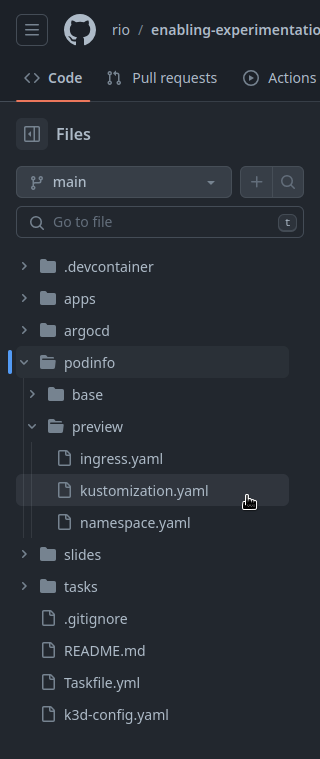

2.2 Click the `Edit this file` button.

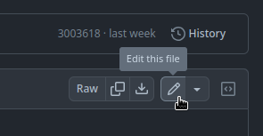

2.3 Change the `newTag` to `6.4.0`.

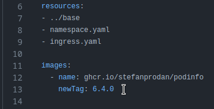

2.4 Commit the changes by clicking the `Commit changes` button.

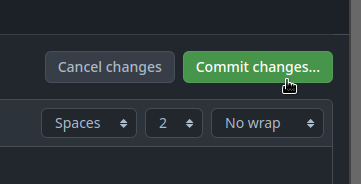

2.5 Commit it to a new branch by clicking the `Create a new branch for this commit and start a pull request` button. Name your branch the same as your username. This will make it easier to find later.

2.6 Click `Propose changes`.


2.7 In the `Open a pull request` page click `Create pull request`.


## 3. Watch the cuttlefish

3.1 Wait for the orange `Some checks haven't completed yet` message to appear.

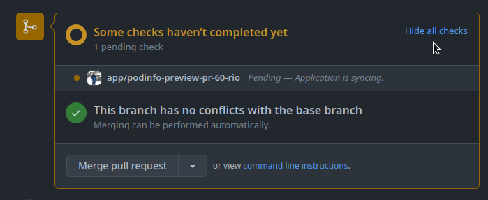

3.2 Once the green `All checks have passed` block appears, click the `Show all checks` button next to it.


3.3 Click the `Details` link next to the `app/...` check.


3.4 Watch the cuttlefish clap. Note the version of the podinfo image.


## 4. Update the application

4.1 Navigate back to your branch by clicking on your branch name near the pull request title.


4.2 Open the `podinfo/preview/kustomization.yaml` file and update the tag again. This time to `6.4.1`.


4.3 Commit it again using the `Commit changes` button and this time use the `Commit directly to the ... branch` option to commit directly to your branch.


4.4 Watch the cuttlefish again. After a while the version number will update to `6.4.1`.


4.5 One final time lets go back to that `podinfo/preview/kustomization.yaml` file and this time let's change the color of the background.

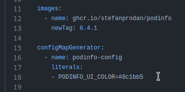

4.6 Commit it and watch the cuttlefish again. After a while the background should change into a nice Fullstaq purple.

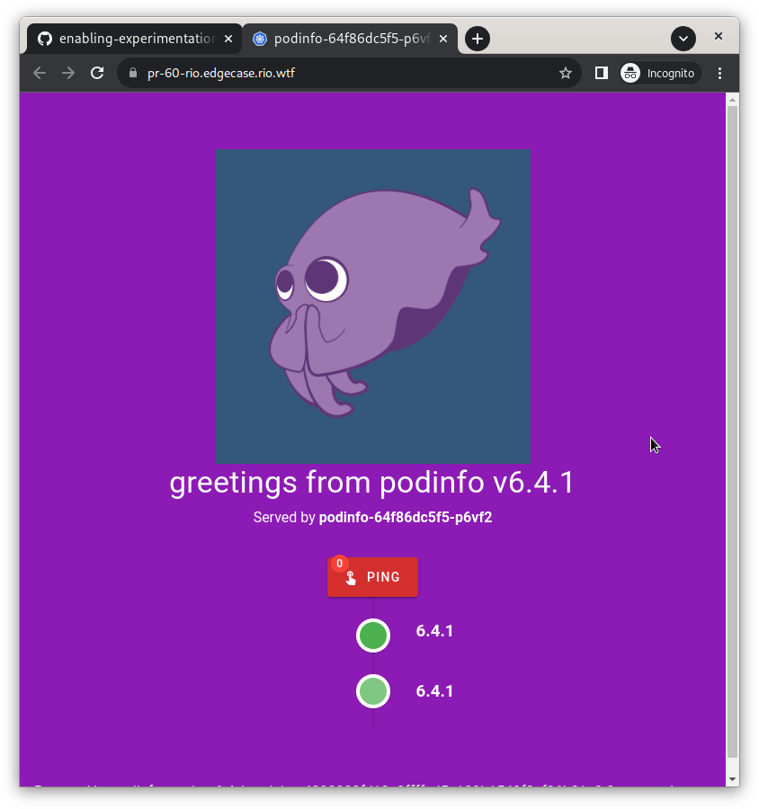

# Workshop Part 2 Work Environment

## 1. Accessing VSCode

1.1 Edit the URL of your cuttlefish page and add `code-` in front of the URL.


1.2 You will be prompted for a password. For your convenience it is set to be the same as your branch name. Simply click the copy button next to your branch name on the pull request page.


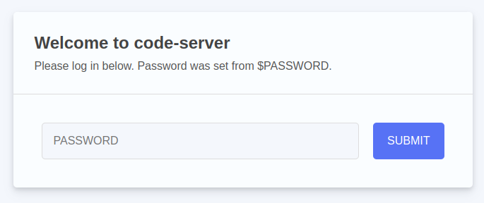

1.3 Click the `Yes I trust the authors button.`

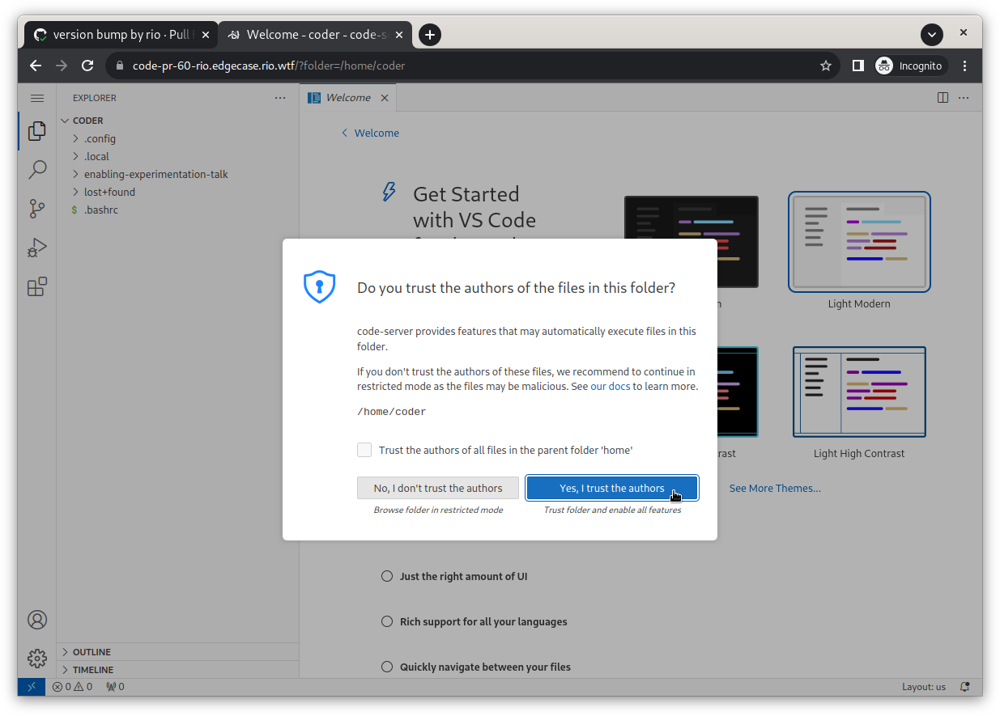

1.4 Optionally change the color theme to something you like by clicking on the `Browse Color Themes` button. Or by clicking on the cog wheel in the bottom left corner then navigate to `Themes -> Color Theme`

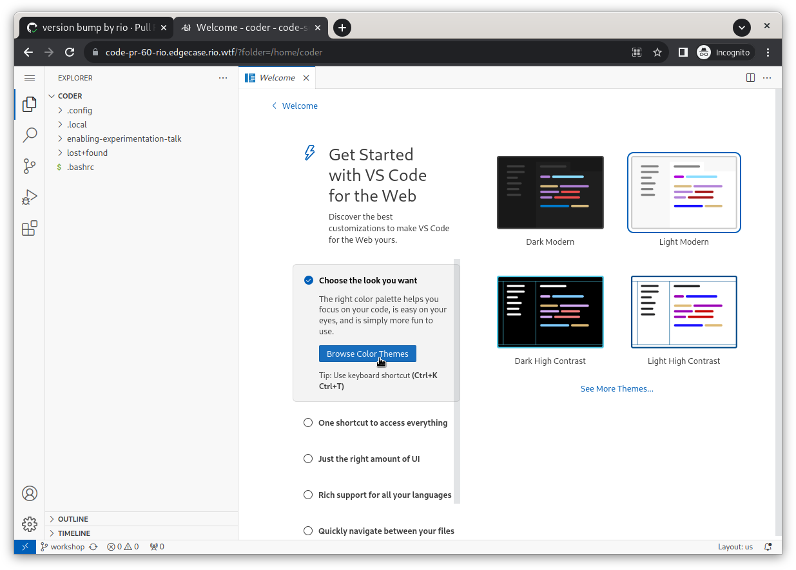


## 2. Taking a look around

2.1 Open a new terminal into the enabling experimentation repo by right clicking the folder on the left and selecting `Open in Integrated Terminal`.


2.2 Checkout your new environment by running kubectl.

```bash
kubectl get pods,svc,ingress -A
```

It should show you something similar to this.

```bash
NAMESPACE     NAME                               READY   STATUS    RESTARTS   AGE
kube-system   pod/coredns-864d4658cb-nq9nb       1/1     Running   0          40m
code-server   pod/code-server-68b7db57fc-jkrpf   1/1     Running   0          39m
podinfo       pod/podinfo-64f86dc5f5-p6vf2       1/1     Running   0          18m
podinfo       pod/podinfo-64f86dc5f5-zwtcn       1/1     Running   0          18m

NAMESPACE     NAME                  TYPE        CLUSTER-IP     EXTERNAL-IP   PORT(S)                  AGE
default       service/kubernetes    ClusterIP   10.43.248.2    <none>        443/TCP                  40m
kube-system   service/kube-dns      ClusterIP   10.43.194.45   <none>        53/UDP,53/TCP,9153/TCP   40m
podinfo       service/podinfo       ClusterIP   10.43.165.98   <none>        9898/TCP,9999/TCP        40m
code-server   service/code-server   ClusterIP   10.43.185.38   <none>        8080/TCP                 39m

NAMESPACE     NAME                                    CLASS     HOSTS                             ADDRESS                                             PORTS   AGE
podinfo       ingress.networking.k8s.io/podinfo       traefik   pr-60-rio.edgecase.rio.wtf        d0f9c870-e66b-45ee-8c7c-6b443de00a93.k8s.civo.com   80      40m
code-server   ingress.networking.k8s.io/code-server   traefik   code-pr-60-rio.edgecase.rio.wtf   d0f9c870-e66b-45ee-8c7c-6b443de00a93.k8s.civo.com   80      39m
```

2.3 Poke your cuttlefish by using curl. Keep hitting it a couple of times and see it load balance between the two pods.

```bash
curl podinfo.podinfo:9898
```

You'll see it respond with a JSON blob containing both the image tag and the background color we set earlier.

```json
{
  "hostname": "podinfo-64f86dc5f5-zwtcn",
  "version": "6.4.1",
  "revision": "4892983fd12e3ffffcd5a189b1549f2ef26b81c2",
  "color": "#8c1bb5",
  "logo": "https://raw.githubusercontent.com/stefanprodan/podinfo/gh-pages/cuddle_clap.gif",
  "message": "greetings from podinfo v6.4.1",
  "goos": "linux",
  "goarch": "amd64",
  "runtime": "go1.21.0",
  "num_goroutine": "8",
  "num_cpu": "4"
}
```

## 3. Deploying a new webserver

3.1 Deploy a new webserver and port-forward it using a task command. 

```bash
task deploy-webserver
```

3.2 Wait until there's a popup notifying your that a new port is forwarded and click open.

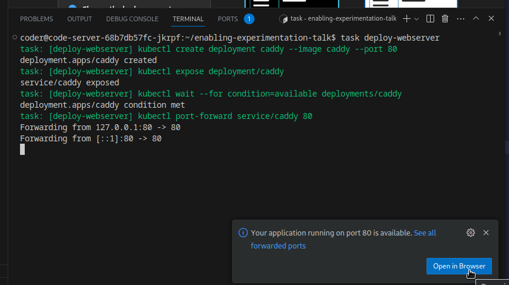

Don't worry if you've missed it. You can find all your forwarded ports under the `ports` tab.


3.3 You should see Caddy's default page.

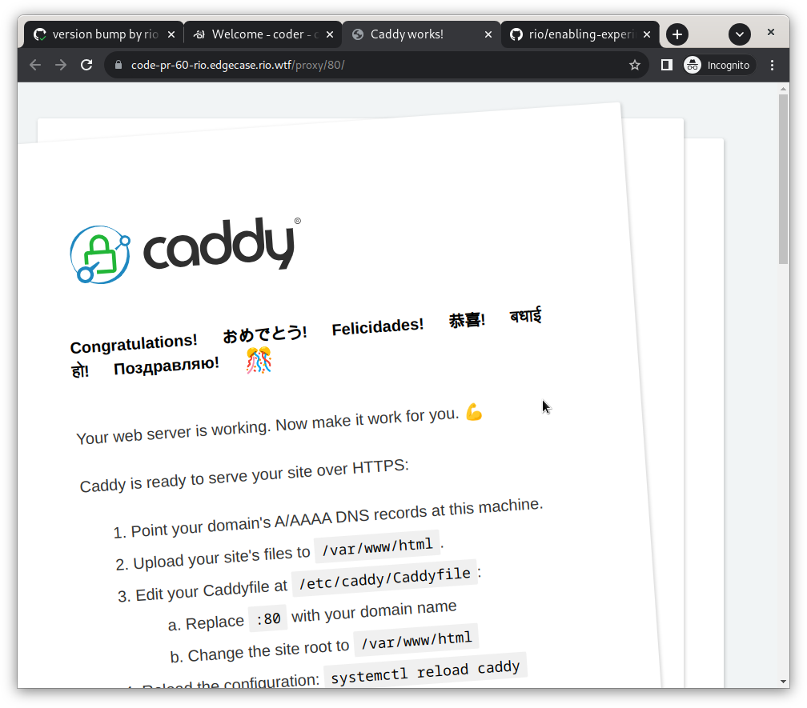

3.4 Kill the port-forward and automatically cleanup the caddy deployment by running `Ctrl + c` in the terminal.

# Workshop Part 3 Infrastucture

## 1. Deploying linkerd

1.1 Lets see how our cuttlefish deals with a service mesh. Install linkerd by running the following task and wait for it to complete.

```bash
task linkerd-install
```

<details>
  <summary>Click here to see the output</summary>

```bash
Rendering Linkerd CRDs...
Next, run `linkerd install | kubectl apply -f -` to install the control plane.

customresourcedefinition.apiextensions.k8s.io/authorizationpolicies.policy.linkerd.io created
customresourcedefinition.apiextensions.k8s.io/httproutes.policy.linkerd.io created
customresourcedefinition.apiextensions.k8s.io/meshtlsauthentications.policy.linkerd.io created
customresourcedefinition.apiextensions.k8s.io/networkauthentications.policy.linkerd.io created
customresourcedefinition.apiextensions.k8s.io/serverauthorizations.policy.linkerd.io created
customresourcedefinition.apiextensions.k8s.io/servers.policy.linkerd.io created
customresourcedefinition.apiextensions.k8s.io/serviceprofiles.linkerd.io created
customresourcedefinition.apiextensions.k8s.io/httproutes.gateway.networking.k8s.io created
task: [linkerd-install] linkerd install --set proxyInit.runAsRoot=true | kubectl apply -f -
namespace/linkerd created
clusterrole.rbac.authorization.k8s.io/linkerd-linkerd-identity created
clusterrolebinding.rbac.authorization.k8s.io/linkerd-linkerd-identity created
serviceaccount/linkerd-identity created
clusterrole.rbac.authorization.k8s.io/linkerd-linkerd-destination created
clusterrolebinding.rbac.authorization.k8s.io/linkerd-linkerd-destination created
serviceaccount/linkerd-destination created
secret/linkerd-sp-validator-k8s-tls created
validatingwebhookconfiguration.admissionregistration.k8s.io/linkerd-sp-validator-webhook-config created
secret/linkerd-policy-validator-k8s-tls created
validatingwebhookconfiguration.admissionregistration.k8s.io/linkerd-policy-validator-webhook-config created
clusterrole.rbac.authorization.k8s.io/linkerd-policy created
clusterrolebinding.rbac.authorization.k8s.io/linkerd-destination-policy created
role.rbac.authorization.k8s.io/remote-discovery created
rolebinding.rbac.authorization.k8s.io/linkerd-destination-remote-discovery created
role.rbac.authorization.k8s.io/linkerd-heartbeat created
rolebinding.rbac.authorization.k8s.io/linkerd-heartbeat created
clusterrole.rbac.authorization.k8s.io/linkerd-heartbeat created
clusterrolebinding.rbac.authorization.k8s.io/linkerd-heartbeat created
serviceaccount/linkerd-heartbeat created
clusterrole.rbac.authorization.k8s.io/linkerd-linkerd-proxy-injector created
clusterrolebinding.rbac.authorization.k8s.io/linkerd-linkerd-proxy-injector created
serviceaccount/linkerd-proxy-injector created
secret/linkerd-proxy-injector-k8s-tls created
mutatingwebhookconfiguration.admissionregistration.k8s.io/linkerd-proxy-injector-webhook-config created
configmap/linkerd-config created
role.rbac.authorization.k8s.io/ext-namespace-metadata-linkerd-config created
secret/linkerd-identity-issuer created
configmap/linkerd-identity-trust-roots created
service/linkerd-identity created
service/linkerd-identity-headless created
deployment.apps/linkerd-identity created
service/linkerd-dst created
service/linkerd-dst-headless created
service/linkerd-sp-validator created
service/linkerd-policy created
service/linkerd-policy-validator created
deployment.apps/linkerd-destination created
cronjob.batch/linkerd-heartbeat created
deployment.apps/linkerd-proxy-injector created
service/linkerd-proxy-injector created
secret/linkerd-config-overrides created
task: [linkerd-install] linkerd viz install | kubectl apply -f -
Waiting for control plane to become available
Waiting for control plane to become available
Waiting for control plane to become available
Waiting for control plane to become available
Waiting for control plane to become available
Waiting for control plane to become available
Waiting for control plane to become available
Waiting for control plane to become available
Waiting for control plane to become available
namespace/linkerd-viz created
clusterrole.rbac.authorization.k8s.io/linkerd-linkerd-viz-metrics-api created
clusterrolebinding.rbac.authorization.k8s.io/linkerd-linkerd-viz-metrics-api created
serviceaccount/metrics-api created
clusterrole.rbac.authorization.k8s.io/linkerd-linkerd-viz-prometheus created
clusterrolebinding.rbac.authorization.k8s.io/linkerd-linkerd-viz-prometheus created
serviceaccount/prometheus created
clusterrole.rbac.authorization.k8s.io/linkerd-linkerd-viz-tap created
clusterrole.rbac.authorization.k8s.io/linkerd-linkerd-viz-tap-admin created
clusterrolebinding.rbac.authorization.k8s.io/linkerd-linkerd-viz-tap created
clusterrolebinding.rbac.authorization.k8s.io/linkerd-linkerd-viz-tap-auth-delegator created
serviceaccount/tap created
rolebinding.rbac.authorization.k8s.io/linkerd-linkerd-viz-tap-auth-reader created
secret/tap-k8s-tls created
apiservice.apiregistration.k8s.io/v1alpha1.tap.linkerd.io created
role.rbac.authorization.k8s.io/web created
rolebinding.rbac.authorization.k8s.io/web created
clusterrole.rbac.authorization.k8s.io/linkerd-linkerd-viz-web-check created
clusterrolebinding.rbac.authorization.k8s.io/linkerd-linkerd-viz-web-check created
clusterrolebinding.rbac.authorization.k8s.io/linkerd-linkerd-viz-web-admin created
clusterrole.rbac.authorization.k8s.io/linkerd-linkerd-viz-web-api created
clusterrolebinding.rbac.authorization.k8s.io/linkerd-linkerd-viz-web-api created
serviceaccount/web created
service/metrics-api created
deployment.apps/metrics-api created
server.policy.linkerd.io/metrics-api created
authorizationpolicy.policy.linkerd.io/metrics-api created
meshtlsauthentication.policy.linkerd.io/metrics-api-web created
networkauthentication.policy.linkerd.io/kubelet created
configmap/prometheus-config created
service/prometheus created
deployment.apps/prometheus created
server.policy.linkerd.io/prometheus-admin created
authorizationpolicy.policy.linkerd.io/prometheus-admin created
service/tap created
deployment.apps/tap created
server.policy.linkerd.io/tap-api created
authorizationpolicy.policy.linkerd.io/tap created
clusterrole.rbac.authorization.k8s.io/linkerd-tap-injector created
clusterrolebinding.rbac.authorization.k8s.io/linkerd-tap-injector created
serviceaccount/tap-injector created
secret/tap-injector-k8s-tls created
mutatingwebhookconfiguration.admissionregistration.k8s.io/linkerd-tap-injector-webhook-config created
service/tap-injector created
deployment.apps/tap-injector created
server.policy.linkerd.io/tap-injector-webhook created
authorizationpolicy.policy.linkerd.io/tap-injector created
networkauthentication.policy.linkerd.io/kube-api-server created
service/web created
deployment.apps/web created
serviceprofile.linkerd.io/metrics-api.linkerd-viz.svc.cluster.local created
serviceprofile.linkerd.io/prometheus.linkerd-viz.svc.cluster.local created
task: [linkerd-install] linkerd check
kubernetes-api
--------------
√ can initialize the client
√ can query the Kubernetes API

kubernetes-version
------------------
√ is running the minimum Kubernetes API version

linkerd-existence
-----------------
√ 'linkerd-config' config map exists
√ heartbeat ServiceAccount exist
√ control plane replica sets are ready
√ no unschedulable pods
√ control plane pods are ready
√ cluster networks contains all pods
√ cluster networks contains all services

linkerd-config
--------------
√ control plane Namespace exists
√ control plane ClusterRoles exist
√ control plane ClusterRoleBindings exist
√ control plane ServiceAccounts exist
√ control plane CustomResourceDefinitions exist
√ control plane MutatingWebhookConfigurations exist
√ control plane ValidatingWebhookConfigurations exist
√ proxy-init container runs as root user if docker container runtime is used

linkerd-identity
----------------
√ certificate config is valid
√ trust anchors are using supported crypto algorithm
√ trust anchors are within their validity period
√ trust anchors are valid for at least 60 days
√ issuer cert is using supported crypto algorithm
√ issuer cert is within its validity period
√ issuer cert is valid for at least 60 days
√ issuer cert is issued by the trust anchor

linkerd-webhooks-and-apisvc-tls
-------------------------------
√ proxy-injector webhook has valid cert
√ proxy-injector cert is valid for at least 60 days
√ sp-validator webhook has valid cert
√ sp-validator cert is valid for at least 60 days
√ policy-validator webhook has valid cert
√ policy-validator cert is valid for at least 60 days

linkerd-version
---------------
√ can determine the latest version
√ cli is up-to-date

control-plane-version
---------------------
√ can retrieve the control plane version
√ control plane is up-to-date
√ control plane and cli versions match

linkerd-control-plane-proxy
---------------------------
√ control plane proxies are healthy
√ control plane proxies are up-to-date
√ control plane proxies and cli versions match

linkerd-viz
-----------
√ linkerd-viz Namespace exists
√ can initialize the client
√ linkerd-viz ClusterRoles exist
√ linkerd-viz ClusterRoleBindings exist
√ tap API server has valid cert
√ tap API server cert is valid for at least 60 days
√ tap API service is running
√ linkerd-viz pods are injected
√ viz extension pods are running
√ viz extension proxies are healthy
√ viz extension proxies are up-to-date
√ viz extension proxies and cli versions match
√ prometheus is installed and configured correctly
√ viz extension self-check

Status check results are √
```
</details>

1.2 Inject the linkerd proxy into our podinfo deployment by running another task. This will also restart the deployment.

```bash
task linkerd-inject
```

<details>
  <summary>Click here to see the output</summary>

```bash
task: [linkerd-inject] kubectl get deployment podinfo -n podinfo -o yaml | linkerd inject - | kubectl apply -f -

deployment "podinfo" injected

deployment.apps/podinfo configured
task: [linkerd-inject] kubectl rollout status deployment/podinfo -n podinfo
Waiting for deployment "podinfo" rollout to finish: 0 out of 2 new replicas have been updated...
Waiting for deployment "podinfo" rollout to finish: 1 out of 2 new replicas have been updated...
Waiting for deployment "podinfo" rollout to finish: 1 out of 2 new replicas have been updated...
Waiting for deployment "podinfo" rollout to finish: 1 out of 2 new replicas have been updated...
Waiting for deployment "podinfo" rollout to finish: 1 out of 2 new replicas have been updated...
Waiting for deployment "podinfo" rollout to finish: 1 old replicas are pending termination...
Waiting for deployment "podinfo" rollout to finish: 1 old replicas are pending termination...
Waiting for deployment "podinfo" rollout to finish: 1 old replicas are pending termination...
deployment "podinfo" successfully rolled out
```

</details>

## 2. Exploring linkerd

2.1 Lets checkout all of the edges between systems that linkerd knows about.

```bash
task linkerd-edges
```

You should be able to see something similar to the following. Note the bottom line which shows the connection between prometheus and podinfo is secured using mTLS.

```bash
task: [linkerd-edges] linkerd viz edges deployments --all-namespaces
SRC           DST                      SRC_NS        DST_NS        SECURED       
metrics-api   prometheus               linkerd-viz   linkerd-viz   √  
prometheus    metrics-api              linkerd-viz   linkerd-viz   √  
prometheus    tap                      linkerd-viz   linkerd-viz   √  
prometheus    tap-injector             linkerd-viz   linkerd-viz   √  
prometheus    web                      linkerd-viz   linkerd-viz   √  
prometheus    linkerd-destination      linkerd-viz   linkerd       √  
prometheus    linkerd-identity         linkerd-viz   linkerd       √  
prometheus    linkerd-proxy-injector   linkerd-viz   linkerd       √  
prometheus    podinfo                  linkerd-viz   podinfo       √
```

2.2 Lets see the http paths that are being called by running `task linkerd-top`.

```bash
task linkerd-top
````

Initially you should see something like this. This is mainly the initial page load (the `/` path)
and the subsequent polls that the frontend does (the `/api/info` paths). Note that both pods are
responding to requests.

```bash
Source       Destination               Method      Path        Count    Best   Worst    Last  Success Rate
192.168.1.4  podinfo-5ff6c6b6c9-n628j  GET         /api/info       3     1ms     5ms     5ms       100.00%
10.42.1.1    podinfo-5ff6c6b6c9-jdjmk  GET         /api/info       2     2ms     2ms     2ms       100.00%
10.42.1.1    podinfo-5ff6c6b6c9-jdjmk  GET         /               1     3ms     3ms     3ms       100.00%
```

2.3 Open a new terminal by clicking the `+` button in the terminal tab.


2.4 In this terminal run the curl command again you used previously to call the podinfo service. 
This time add `/status/500` to the curl command to let it fail and see that path show up in the linkerd output.

```bash
curl podinfo.podinfo:9898/status/500
```

You'll see the path show up in the linkerd output with a success rate of 0.00%.

```bash
Source                        Destination               Method      Path          Count    Best   Worst    Last  Success Rate
...
code-server-68b7db57fc-jkrpf  podinfo-5ff6c6b6c9-n628j  GET         /status/500       1     2ms     2ms     2ms         0.00%
```

# Workshop Part 4 (optional) Clusters in Clusters in Clusters

1. Open a terminal and create a vcluster by running the following command.

```bash
vcluster create test-cluster
```

It should start port forwarding to the new kubernetes api that just got created.

```bash
info   Downloading [command helm]
info   Create vcluster test-cluster...
info   execute command: helm upgrade test-cluster /tmp/vcluster-0.15.7.tgz-2160875115 --kubeconfig /tmp/997274681 --namespace code-server --install --repository-config='' --values /tmp/3780948728
done √ Successfully created virtual cluster test-cluster in namespace code-server
info   Waiting for vcluster to come up...
warn   vcluster is waiting, because vcluster pod test-cluster-0 has status: PodInitializing
warn   vcluster is waiting, because vcluster pod test-cluster-0 has status: PodInitializing
warn   vcluster is waiting, because vcluster pod test-cluster-0 has status: PodInitializing
warn   vcluster is waiting, because vcluster pod test-cluster-0 has status: PodInitializing
done √ Switched active kube context to vcluster_test-cluster_code-server_
warn   Since you are using port-forwarding to connect, you will need to leave this terminal open
- Use CTRL+C to return to your previous kube context
- Use `kubectl get namespaces` in another terminal to access the vcluster
Forwarding from 127.0.0.1:10071 -> 8443
Forwarding from [::1]:10071 -> 8443
```

2. Once it starts forwarding a connection open a new terminal and run kubectl again.

```bash
kubectl get pods -A
```

This should list all the pods in the vcluster. But because vcluster is so minimal you'll only see
the coredns pod.

```bash
NAMESPACE     NAME                       READY   STATUS    RESTARTS   AGE
kube-system   coredns-864d4658cb-9jxsq   1/1     Running   0          106s
```

3. Terminate the `vcluster create` command and run `kubectl get pods -A` one last time.

```bash
kubectl get pods -A
```

You'll see the new coredns pod and a new vcluster pod in the code-server namespace.

```bash
NAMESPACE     NAME                                                    READY   STATUS    RESTARTS   AGE
kube-system   coredns-864d4658cb-nq9nb                                1/1     Running   0          82m
code-server   code-server-68b7db57fc-jkrpf                            1/1     Running   0          81m
...
podinfo       podinfo-5ff6c6b6c9-jdjmk                                2/2     Running   0          20m
podinfo       podinfo-5ff6c6b6c9-n628j                                2/2     Running   0          20m
code-server   test-cluster-0                                          2/2     Running   0          4m16s
code-server   coredns-864d4658cb-9jxsq-x-kube-system-x-test-cluster   1/1     Running   0          3m8s
```

4. Delete the vcluster by running `vcluster delete test-cluster`

```bash
vcluster delete test-cluster
```

# Workshop Final Part

1. Close your pull request and watch it all disappear.

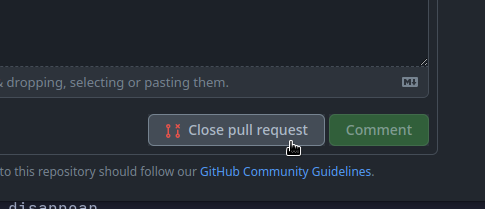
